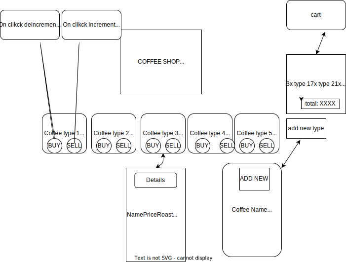

# Coffee Shop
## Local Business Inventory Tracker

#### By Gabriel Tucker

## Component Diagram
 

## Components Tree
```
 App
├── Header
│   │   - Title Name
├── BodyControl
|   |   - Handles all Componets
|   ├── EditItemForm
|   |       - Updates already made coffee roasts
│   ├── MasterList
|   |   ├──MasterList
|   |      -First 5 Coffee Roast
│   ├── ItemDetail
|   |   -Shows details of coffee types on detail page
│   ├── Items
|   |   -Shows details of coffee types on main page
│   ├── ItemsList
|   |   -Makes a List of bought roast on the right side of page
│   ├── NewItemForm 
|   |   -Makes a new coffee roast 
│   ├── ReuseableForm
|   |   -Form for making new coffee
```

## Technologies Used

* Html
* Javascript, ES6
* CSS
* React
* npm 
* ESLint
* uuid
* Git
* vite
* Redux/toolkit

## Setup/Installation Requirements

1. go to my github repository for the project (https://github.com/gabe9t/projectweek8)

2. Click the 'code' button and copy the url for HTTPS.

3. Open Bash and type: <b>`git clone https://github.com/Gabe9T/projectweek8.git`<b>

4. Open cloned file in VsCode

5. to run the Project site, type these commands into terminal: `npm install`, `npm run dev`, `o + enter`

## Known Bugs
* cant refactor the site completely. not sure what i can do to fix

## Other repo
repo this is copied from 
(https://github.com/gabe9t/projectweek8)

## License
MIT License. See license.md for further information
